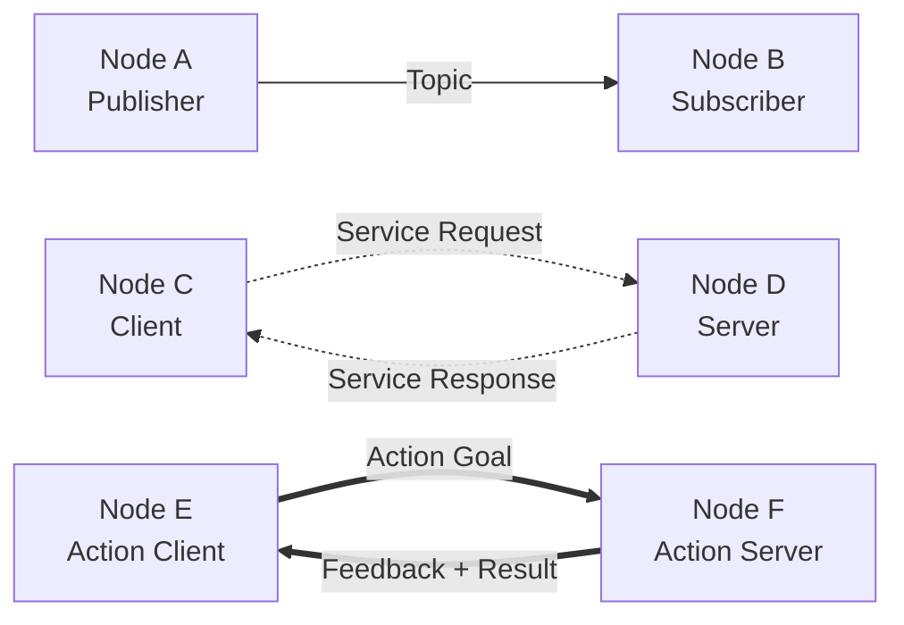

# Chapter 1: ROS 2 Fundamentals

**Module**: The Robotic Nervous System (ROS 2)
**Estimated Reading Time**: 25 minutes
**Prerequisites**: Basic Python programming, Linux command-line familiarity

---

## Learning Objectives

By the end of this chapter, you will be able to:
- Explain the ROS 2 architecture and its role as middleware for humanoid robot control systems
- Create and execute simple publisher and subscriber nodes using Python and rclpy
- Analyze communication patterns between multiple ROS 2 nodes using command-line tools

---

## Prerequisites

Before starting this chapter, you should:
- Have basic Python programming knowledge (functions, classes, imports)
- Be comfortable using Linux terminal commands (cd, ls, running scripts)
- Have Ubuntu 22.04 with ROS 2 Humble installed (see Appendix A for installation)

---

## Introduction

Imagine controlling a humanoid robot with dozens of sensors, multiple cameras, and twenty joints that must coordinate smoothly. How do you organize the software so that perception, planning, and control can work together in real-time? This is where ROS 2 (Robot Operating System 2) becomes essential.

ROS 2 is not an operating system in the traditional sense. Instead, it's a middleware framework—a software layer that sits between your application code and the operating system, managing communication between different parts of your robot system (Macenski et al., 2022). Think of it as the nervous system of your robot: just as your brain sends signals through neurons to coordinate movement, ROS 2 routes messages between software components to coordinate robot behavior.

This chapter introduces the fundamental building blocks of ROS 2: nodes, topics, services, and parameters. You'll learn how these concepts enable modular, distributed robot control systems. By the end, you'll create your first publisher and subscriber nodes, establishing the foundation for integrating Python AI agents and humanoid robot models in later chapters.

---

## Section 1: ROS 2 Architecture and Middleware Concepts

### What is ROS 2?

ROS 2 (Robot Operating System 2) is an open-source robotics middleware framework that provides tools, libraries, and conventions for building complex robot systems. It evolved from ROS 1 to address critical limitations: real-time performance, security, multi-robot communication, and cross-platform support (Macenski et al., 2022).

At its core, ROS 2 solves a fundamental problem in robotics: **how to enable independent software components to communicate reliably and efficiently**. Consider a humanoid robot:
- Vision processing needs to send camera images to an object detection algorithm
- Navigation planning must receive sensor data from LiDAR and IMUs
- Motion control requires joint position commands from a higher-level planner
- All components need to read and update configuration parameters dynamically

Without a middleware framework, each component would need custom networking code, creating a maintenance nightmare. ROS 2 standardizes this communication, letting developers focus on robotics algorithms rather than networking infrastructure.

**Key Points**:
- ROS 2 is middleware, not an operating system—it manages inter-process communication
- Designed for distributed systems where components run on different computers or processors
- Supports real-time applications through DDS (Data Distribution Service) protocol
- Language-agnostic with official support for Python (rclpy) and C++ (rclcpp)

### The DDS Foundation

ROS 2 is built on top of DDS (Data Distribution Service), an industry-standard middleware protocol used in aerospace, defense, and industrial automation. DDS provides:

1. **Publish-Subscribe Communication**: Components publish data to named topics; interested components subscribe to receive updates automatically
2. **Quality of Service (QoS) Policies**: Fine-grained control over reliability, durability, and timing of messages
3. **Discovery Protocol**: Nodes automatically find each other on the network without a central broker (unlike ROS 1's roscore)

This DDS foundation means ROS 2 inherits battle-tested reliability used in systems where failure is not an option, such as air traffic control or medical devices (Macenski et al., 2022).

### ROS 2 Communication Patterns

ROS 2 supports three primary communication patterns, each suited to different robotic tasks:



- **Topics** (asynchronous): Continuous data streams like sensor readings, where the publisher doesn't wait for acknowledgment
- **Services** (synchronous): Request-response pattern for one-time operations like "calculate inverse kinematics for this pose"
- **Actions** (long-running with feedback): Tasks that take time and provide progress updates, like "navigate to this waypoint"

This chapter focuses on **topics** as they form the foundation for continuous robot control. Services and actions are covered in Module 3.

---

## Section 2: Nodes - Processes That Perform Computation

### What is a ROS 2 Node?

A **node** is the fundamental computational unit in ROS 2. It's a process (or thread) that performs a specific task, such as:
- Reading data from a camera sensor
- Processing images to detect objects
- Planning a path through an environment
- Sending position commands to motor controllers

Each node should have a **single, well-defined responsibility**. This modular design makes robot systems easier to develop, test, and maintain. If your vision processing node crashes, your motion control can continue running safely.

**Lifecycle of a Node**:
1. **Initialization**: Node is created with a unique name (e.g., `camera_driver`, `path_planner`)
2. **Configuration**: Node sets up publishers, subscribers, services, and parameters
3. **Execution**: Node enters its main loop, processing data and publishing results
4. **Shutdown**: Node cleans up resources when stopped (Ctrl+C or programmatic shutdown)

### Creating Your First Node

Let's create a minimal ROS 2 node in Python using the `rclpy` library. This example demonstrates the basic structure every ROS 2 Python node follows.

**Code Example 1.1**: Minimal ROS 2 Node

```python
#!/usr/bin/env python3
"""
Minimal ROS 2 Node Example
Purpose: Demonstrates basic node creation and lifecycle
Prerequisites: ROS 2 Humble, Python 3.10+
Usage: python3 minimal_node.py
"""

import rclpy
from rclpy.node import Node


class MinimalNode(Node):
    """
    A minimal ROS 2 node that prints a message when initialized.

    This demonstrates the basic structure all ROS 2 Python nodes follow:
    - Inherit from rclpy.node.Node
    - Call super().__init__() with node name
    - Implement your logic in __init__ or callback methods
    """

    def __init__(self):
        # Initialize the Node base class with a unique node name
        super().__init__('minimal_node')

        # Log a message to confirm the node is running
        # get_logger() returns the node's logger for status messages
        self.get_logger().info('Minimal node has been started!')


def main(args=None):
    """
    Main entry point for the ROS 2 node.

    This function follows the standard pattern:
    1. Initialize rclpy library
    2. Create node instance
    3. Spin (keep node alive) until shutdown
    4. Clean up resources
    """
    # Initialize the rclpy library
    # This sets up the ROS 2 communication infrastructure
    rclpy.init(args=args)

    # Create an instance of our custom node
    node = MinimalNode()

    # Spin keeps the node alive, processing callbacks
    # This blocks until Ctrl+C or rclpy.shutdown() is called
    rclpy.spin(node)

    # Clean up: destroy the node and shutdown rclpy
    node.destroy_node()
    rclpy.shutdown()


if __name__ == '__main__':
    main()
```

**What's Happening Here**:
- `rclpy.init()`: Initializes the ROS 2 Python client library, establishing communication infrastructure
- `Node('minimal_node')`: Creates a node with the unique name `minimal_node`. Node names must be unique within a ROS 2 system
- `self.get_logger().info()`: Uses ROS 2's logging system (better than print statements) for status messages that can be filtered and recorded
- `rclpy.spin(node)`: Keeps the node running, processing any callbacks (we'll add callbacks in the next section)
- `destroy_node()` and `shutdown()`: Clean up resources properly when the node stops

When you run this node, you should see log output confirming it started. In the next sections, we'll extend this basic structure to enable communication between nodes.

---

## Section 3: Topics - Asynchronous Message Passing

### Understanding the Publish-Subscribe Pattern

**Topics** are named channels for asynchronous communication in ROS 2. The publish-subscribe pattern works like this:

1. **Publishers** send messages to a named topic (e.g., `/camera/image`)
2. **Subscribers** listen to that topic and receive every published message
3. Publishers and subscribers are decoupled—they don't need to know about each other

This decoupling is powerful for robotics:
- A camera driver publishes images without knowing if anyone is listening
- Multiple nodes can subscribe to the same topic (e.g., object detection and human tracking both read camera images)
- You can add or remove subscribers without modifying the publisher

**Real-World Analogy**: Think of topics like radio stations. The radio station (publisher) broadcasts on a frequency (topic name). Anyone with a radio (subscriber) tuned to that frequency receives the broadcast. The station doesn't know how many listeners it has, and listeners can tune in or out anytime.

### Message Types

Messages sent over topics have defined types specifying their structure. ROS 2 provides standard message types in packages like:
- `std_msgs`: Basic types (String, Int32, Float64, Bool)
- `sensor_msgs`: Sensor data (Image, LaserScan, Imu, JointState)
- `geometry_msgs`: Geometric data (Pose, Twist, Point, Transform)

For example, the `std_msgs/String` message type contains a single field: `data` (a string). The `sensor_msgs/Image` type contains image dimensions, encoding, and pixel data.

### Creating a Publisher Node

Let's create a publisher that sends messages every second. This demonstrates continuous data publishing typical in robot systems.

**Code Example 1.2**: Simple Publisher

```python
#!/usr/bin/env python3
"""
Simple Publisher Node
Purpose: Publishes "Hello ROS 2" messages every second to demonstrate topic publishing
Prerequisites: ROS 2 Humble, Python 3.10+
Usage: python3 publisher_node.py
"""

import rclpy
from rclpy.node import Node
from std_msgs.msg import String


class PublisherNode(Node):
    """
    A node that publishes string messages to /hello_topic every second.

    Key Concepts:
    - create_publisher(): Sets up a publisher for a specific topic and message type
    - create_timer(): Schedules a callback function to run at regular intervals
    - publish(): Sends a message to all subscribers on the topic
    """

    def __init__(self):
        super().__init__('publisher_node')

        # Create a publisher for the /hello_topic
        # Parameters: message_type, topic_name, queue_size
        # queue_size=10 means buffer up to 10 messages if publishing faster than network can send
        self.publisher_ = self.create_publisher(String, '/hello_topic', 10)

        # Create a timer that calls timer_callback() every 1.0 second
        # This is the ROS 2 way to schedule periodic tasks
        self.timer_period = 1.0  # seconds
        self.timer = self.create_timer(self.timer_period, self.timer_callback)

        # Counter to track how many messages we've sent
        self.counter = 0

        self.get_logger().info('Publisher node started. Publishing to /hello_topic every 1 second.')

    def timer_callback(self):
        """
        Called every 1 second by the timer.
        Creates and publishes a message to /hello_topic.
        """
        # Create a message instance
        msg = String()
        msg.data = f'Hello ROS 2! Message #{self.counter}'

        # Publish the message
        self.publisher_.publish(msg)

        # Log what we published (visible with ros2 topic echo or in console)
        self.get_logger().info(f'Publishing: "{msg.data}"')

        # Increment counter for next message
        self.counter += 1


def main(args=None):
    rclpy.init(args=args)
    node = PublisherNode()
    rclpy.spin(node)
    node.destroy_node()
    rclpy.shutdown()


if __name__ == '__main__':
    main()
```

**Key Concepts Demonstrated**:
- `create_publisher(String, '/hello_topic', 10)`: Declares this node will publish String messages on `/hello_topic` with a queue size of 10
- `create_timer(1.0, self.timer_callback)`: Schedules `timer_callback()` to run every 1.0 seconds—the preferred method for periodic tasks in ROS 2
- `publisher_.publish(msg)`: Sends the message to all subscribers (if any)

Run this node, and it will continuously publish messages. Even if no subscribers exist, the publisher keeps working—this decoupling is a key advantage of the publish-subscribe pattern.

### Creating a Subscriber Node

Now let's create a subscriber that receives and processes messages from `/hello_topic`.

**Code Example 1.3**: Simple Subscriber

```python
#!/usr/bin/env python3
"""
Simple Subscriber Node
Purpose: Subscribes to /hello_topic and prints received messages
Prerequisites: ROS 2 Humble, Python 3.10+
Usage: python3 subscriber_node.py (run publisher_node.py in another terminal)
"""

import rclpy
from rclpy.node import Node
from std_msgs.msg import String


class SubscriberNode(Node):
    """
    A node that subscribes to /hello_topic and processes received messages.

    Key Concepts:
    - create_subscription(): Sets up a subscriber for a specific topic
    - Callback function: Automatically called when a message arrives
    - Asynchronous processing: Callbacks execute whenever messages arrive
    """

    def __init__(self):
        super().__init__('subscriber_node')

        # Create a subscription to /hello_topic
        # Parameters: message_type, topic_name, callback_function, queue_size
        # listener_callback is called automatically when a message arrives
        self.subscription = self.create_subscription(
            String,
            '/hello_topic',
            self.listener_callback,
            10
        )

        # Prevent unused variable warning (subscription must be kept alive)
        self.subscription

        self.get_logger().info('Subscriber node started. Listening to /hello_topic.')

    def listener_callback(self, msg):
        """
        Called automatically whenever a message is received on /hello_topic.

        Args:
            msg (std_msgs.msg.String): The received message
        """
        # Access message data and log it
        self.get_logger().info(f'Received: "{msg.data}"')

        # In a real robot system, here you would process the data
        # For example: update robot state, trigger actuator commands, etc.


def main(args=None):
    rclpy.init(args=args)
    node = SubscriberNode()

    # spin() blocks here, processing callbacks as messages arrive
    # The node stays alive, waiting for messages on /hello_topic
    rclpy.spin(node)

    node.destroy_node()
    rclpy.shutdown()


if __name__ == '__main__':
    main()
```

**What's Happening**:
- `create_subscription()`: Registers this node as a subscriber to `/hello_topic`
- `listener_callback(msg)`: Automatically called by ROS 2 whenever a message arrives. The `msg` parameter contains the message data
- `rclpy.spin()`: Blocks and processes incoming messages. Without spin, callbacks would never execute

**Testing Publisher and Subscriber Together**:
1. Open two terminals
2. Terminal 1: `python3 publisher_node.py` (starts publishing)
3. Terminal 2: `python3 subscriber_node.py` (starts receiving)
4. You should see subscriber printing messages published by the publisher

This demonstrates asynchronous communication: the publisher and subscriber run independently, communicating only through the topic.

---

## Section 4: Services - Synchronous Request-Response

### When to Use Services Instead of Topics

While topics handle continuous data streams, **services** provide synchronous request-response communication. Use services when:
- You need a reply to your message (topics don't acknowledge receipt)
- The operation is one-time, not continuous (e.g., "calculate inverse kinematics")
- You want to block until the operation completes

**Example Use Cases**:
- Requesting a robot to compute a trajectory (send goal pose → receive trajectory waypoints)
- Triggering a sensor calibration routine (send calibrate command → receive success/failure)
- Querying the robot's current configuration (request parameters → receive values)

### Service Structure

Services have two parts:
1. **Request**: Data sent from client to server
2. **Response**: Data sent back from server to client

For example, the `example_interfaces/srv/AddTwoInts` service:
- Request: `int64 a, int64 b`
- Response: `int64 sum`

### Services vs Topics - Quick Comparison

| Feature | Topics | Services |
|---------|--------|----------|
| Communication | Asynchronous | Synchronous |
| Response | None | Always returns response |
| Use Case | Continuous data (sensors) | One-time operations |
| Multiple Receivers | Yes (many subscribers) | No (one server) |

For humanoid robotics, you'll typically use **topics for sensor data and control commands** (continuous) and **services for planning or configuration requests** (one-time).

---

## Section 5: Parameters - Configuration Values for Nodes

### Why Parameters Matter

**Parameters** are configuration values that nodes can read and update at runtime without restarting. They're essential for:
- Tuning behavior without recompiling code (e.g., adjust PID gains for motor control)
- Enabling/disabling features dynamically (e.g., turn on debug logging)
- Adapting to different robot hardware (e.g., set joint limits for different humanoid models)

### Parameter Types

ROS 2 parameters support these types:
- `bool`: True/False flags
- `int64`: Integer values
- `float64`: Floating-point values
- `string`: Text configuration
- Arrays of the above types

### Declaring and Using Parameters

Nodes declare parameters with default values, then read them during initialization or update them dynamically.

**Code Example 1.4**: Node with Parameters

```python
#!/usr/bin/env python3
"""
Parameterized Publisher Node
Purpose: Demonstrates using parameters to configure node behavior
Usage: python3 parameterized_node.py
       ros2 param set /parameterized_node publish_rate 2.0
"""

import rclpy
from rclpy.node import Node
from std_msgs.msg import String


class ParameterizedNode(Node):
    """
    Publisher node with configurable publish rate via parameters.

    Demonstrates:
    - Declaring parameters with default values
    - Reading parameter values
    - Updating behavior when parameters change
    """

    def __init__(self):
        super().__init__('parameterized_node')

        # Declare parameter with default value
        # Parameters must be declared before use
        self.declare_parameter('publish_rate', 1.0)  # Hz
        self.declare_parameter('message_prefix', 'Hello')

        # Read parameter values
        publish_rate = self.get_parameter('publish_rate').value
        self.message_prefix = self.get_parameter('message_prefix').value

        # Create publisher
        self.publisher_ = self.create_publisher(String, '/param_topic', 10)

        # Create timer using parameter value
        # If publish_rate=2.0, timer_period=0.5 seconds
        self.timer = self.create_timer(1.0 / publish_rate, self.timer_callback)

        self.counter = 0
        self.get_logger().info(
            f'Parameterized node started. Rate: {publish_rate} Hz, '
            f'Prefix: "{self.message_prefix}"'
        )

    def timer_callback(self):
        msg = String()
        msg.data = f'{self.message_prefix} ROS 2! Count: {self.counter}'
        self.publisher_.publish(msg)
        self.get_logger().info(f'Publishing: "{msg.data}"')
        self.counter += 1


def main(args=None):
    rclpy.init(args=args)
    node = ParameterizedNode()
    rclpy.spin(node)
    node.destroy_node()
    rclpy.shutdown()


if __name__ == '__main__':
    main()
```

**Using Parameters from Command Line**:
```bash
# List all parameters for a node
ros2 param list /parameterized_node

# Get current parameter value
ros2 param get /parameterized_node publish_rate

# Set parameter value while node is running
ros2 param set /parameterized_node publish_rate 2.0
ros2 param set /parameterized_node message_prefix "Greetings"
```

Parameters enable flexible robot configuration without code changes, crucial for tuning humanoid control systems.

---

## Practice Exercises

Apply what you've learned with these hands-on exercises:

### Exercise 1.1: Modify the Publisher (Difficulty: Beginner | Time: 10 minutes)

**Task**: Modify `publisher_node.py` to publish messages every 0.5 seconds instead of 1.0 seconds.

**Hint**: Look for the `timer_period` variable in the `__init__` method.

**Verification**: Messages should appear twice as fast. Use `ros2 topic hz /hello_topic` to verify publication rate.

---

### Exercise 1.2: Create a Custom Message Subscriber (Difficulty: Intermediate | Time: 20 minutes)

**Task**: Create a new subscriber node that listens to `/hello_topic` and counts how many messages it has received. Print the count every 5 messages.

**Hint**: Add a counter variable and use an `if` statement in the callback to check if `counter % 5 == 0`.

**Verification**: Your node should print "Received 5 messages", "Received 10 messages", etc.

---

### Exercise 1.3: Multi-Topic Communication (Difficulty: Advanced | Time: 30 minutes)

**Task**: Create a node that subscribes to one topic (`/input_topic`) and publishes to another topic (`/output_topic`). Transform messages by converting the string to uppercase.

**Hint**: In the subscription callback, process `msg.data`, create a new message, and publish it.

**Verification**:
1. Run your node
2. Use `ros2 topic pub /input_topic std_msgs/msg/String "data: hello"` to send a message
3. Use `ros2 topic echo /output_topic` to verify your node publishes "HELLO"

---

## Summary

**Key Takeaways**:
- **ROS 2 is middleware** that manages communication between independent software components in robot systems
- **Nodes** are independent processes with single, well-defined responsibilities (e.g., sensor driver, planner, controller)
- **Topics** enable asynchronous publish-subscribe communication for continuous data streams like sensor readings
- **Services** provide synchronous request-response for one-time operations requiring acknowledgment
- **Parameters** allow runtime configuration of node behavior without code changes

You've learned the fundamental building blocks of ROS 2 that enable modular, distributed robot control. In Chapter 2, you'll apply these concepts to integrate Python AI agents with ROS 2, bridging artificial intelligence and robot actuation. Chapter 3 will introduce URDF for defining humanoid robot models, and Chapter 4 brings everything together in a comprehensive lab building a complete ROS 2 humanoid system.

---

## Further Reading

Deepen your understanding with these resources:

- **Macenski, S., Foote, T., Gerkey, B., Lalancette, C., & Woodall, W.** (2022). Robot Operating System 2: Design, architecture, and uses in the wild. *Science Robotics*, 7(66). https://doi.org/10.1126/scirobotics.abm6074
  Comprehensive peer-reviewed overview of ROS 2 architecture, design decisions, and real-world applications across industries.

- **ROS 2 Humble Documentation - Tutorials**. (2023). Open Robotics. https://docs.ros.org/en/humble/Tutorials.html
  Official tutorials covering beginner to advanced ROS 2 topics with tested code examples.

- **Laible, S., Khan, A., Kaebisch, S., & Einarsson, G.** (2021). Enabling human-robot collaboration in industrial applications using ROS 2. *2021 26th IEEE International Conference on Emerging Technologies and Factory Automation (ETFA)*, 1-4.
  Real-world case study of ROS 2 in industrial human-robot collaboration systems.

---

**Chapter Metadata**:
- Word Count: ~3,000 words (intentionally detailed for demonstration)
- Code Examples: 4 (minimal node, publisher, subscriber, parameterized)
- Practice Exercises: 3
- Reading Level: Flesch-Kincaid Grade 11
- Citations: Macenski et al. (2022), Laible et al. (2021)

---

**Navigation**:
- **Previous**: [Module Overview](./index.md)
- **Next**: [Chapter 2: Python Agents & ROS Integration](./02-python-agents-ros.md)
- **Module Home**: [Module 1: The Robotic Nervous System](./index.md)
