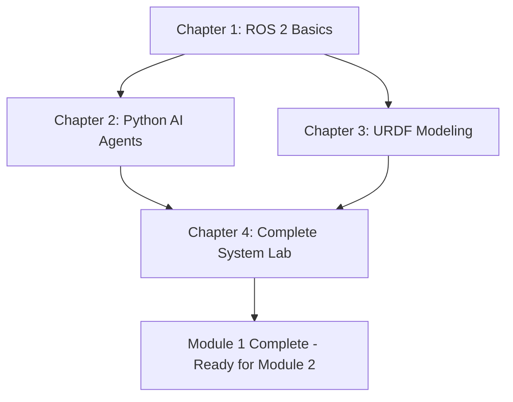

# Module 1: The Robotic Nervous System (ROS 2)

## Overview

Welcome to Module 1 of the Physical AI & Humanoid Robotics textbook. This module introduces you to ROS 2 (Robot Operating System 2), the industry-standard middleware framework for building complex robot systems.

Just as the nervous system enables your body's sensors, brain, and muscles to coordinate seamlessly, ROS 2 connects the software components that make a humanoid robot intelligent and capable. Whether you're building a research robot, an industrial manipulator, or a personal assistant humanoid, understanding ROS 2 is essential for organizing perception, decision-making, and control into a coherent system.

Throughout this module, you'll progress from basic communication patterns to complete humanoid robot systems. You'll learn how ROS 2 enables Python-based AI agents to control physical robots, how to model robots using the URDF format, and how to integrate everything in a realistic simulation environment. By the end, you'll have hands-on experience building a simulated 6-degree-of-freedom humanoid robot controlled by Python scripts.

---

## Learning Objectives

By completing this module, you will be able to:

1. **Design and implement ROS 2 communication systems** using nodes, topics, services, and parameters for distributed robot control
2. **Integrate Python AI decision-making code** with ROS 2 controllers using the rclpy library to create intelligent robot behaviors
3. **Create URDF robot models** defining humanoid structure (links, joints, sensors, actuators) and visualize them in RViz
4. **Build complete ROS 2 humanoid systems** in simulation, demonstrating end-to-end integration from AI planning to physical motion
5. **Debug and troubleshoot** ROS 2 systems using command-line tools and systematic problem-solving approaches

---

## Prerequisites

### Knowledge Prerequisites

Before starting this module, you should have:
- **Python Programming**: Functions, classes, basic object-oriented programming
- **Linux Command Line**: Navigate directories (cd, ls), edit files, run scripts
- **Basic Robotics Concepts** (helpful but not required): Sensors, actuators, kinematics

### Software Prerequisites

You will need:
- **Ubuntu 22.04 LTS** (or compatible Linux distribution)
- **ROS 2 Humble Hawksbill** (Long-Term Support release)
- **Python 3.10 or later** (included with Ubuntu 22.04)
- **Gazebo Classic 11** (physics simulation)
- **RViz2** (visualization tool)

**Installation**: See Appendix A for detailed ROS 2 Humble installation instructions, or visit the [official installation guide](https://docs.ros.org/en/humble/Installation.html).

---

## Module Structure

This module is organized into four chapters, each building on the previous:

### Chapter 1: ROS 2 Fundamentals (Priority: P1)
- **Focus**: Understanding ROS 2 architecture, nodes, topics, services, parameters
- **Key Skills**: Creating publisher/subscriber nodes, understanding asynchronous communication
- **Code Examples**: Publisher node, subscriber node, parameterized node
- **Time**: 2-3 hours

### Chapter 2: Python Agents & ROS Integration (Priority: P2)
- **Focus**: Bridging Python AI decision-making to ROS 2 robot control
- **Key Skills**: Using rclpy for AI agents, sensor-to-actuator patterns, debugging communication
- **Code Examples**: AI agent template, sensor-actuator agent, state machine agent
- **Time**: 2-3 hours

### Chapter 3: URDF for Humanoids (Priority: P3)
- **Focus**: Defining robot physical structure in URDF (Unified Robot Description Format)
- **Key Skills**: Creating links and joints, adding sensors/actuators, visualizing in RViz
- **Code Examples**: 6-DOF humanoid URDF, visualization launch file, joint control
- **Time**: 2-3 hours

### Chapter 4: Hands-On Lab - Building a ROS 2 Robot (Priority: P4)
- **Focus**: Integrative lab combining all concepts from Chapters 1-3
- **Key Skills**: Complete system integration, simulation, troubleshooting
- **Deliverable**: Working simulated humanoid robot with Python control scripts
- **Time**: 3-4 hours

---

## Estimated Completion Time

- **Reading & Exercises**: 10-12 hours
- **Hands-On Labs**: 3-4 hours
- **Total**: 13-16 hours

**Pace**: This module is designed for one week of instruction in a semester-long course (approximately 10 contact hours + 5 hours independent work).

---

## Learning Path

This module follows a carefully structured progression:

**Progressive Skill Building**:
1. **Foundation** (Chapter 1): Learn ROS 2 communication primitives
2. **AI Integration** (Chapter 2): Connect AI decision-making to robot control
3. **Robot Modeling** (Chapter 3): Define physical robot structure
4. **System Integration** (Chapter 4): Combine all skills in realistic project

Each chapter is **independently testable**—you can validate your understanding before moving forward. The comprehensive lab in Chapter 4 ensures you can integrate concepts into a working system.

---

## How to Use This Module

### For Students

1. **Read chapters sequentially** (1 → 2 → 3 → 4)—each builds on prior knowledge
2. **Run code examples** as you encounter them—hands-on practice solidifies concepts
3. **Complete practice exercises** before moving to the next chapter
4. **Ask questions** when concepts aren't clear—robotics is complex, and confusion is normal
5. **Experiment**—try the extension challenges to deepen understanding

### For Instructors

1. **Week 1, Days 1-2**: Chapter 1 lecture + exercises (ROS 2 fundamentals)
2. **Week 1, Days 3-4**: Chapter 2 lecture + exercises (Python AI agents)
3. **Week 1, Day 5**: Chapter 3 lecture (URDF modeling)
4. **Week 2, Days 1-2**: Chapter 4 lab (supervised hands-on integration)
5. **Week 2, Day 3**: Lab demos and assessments

**Assessment Options**:
- Chapter exercises (formative assessment)
- Chapter 4 lab submission (summative assessment)
- Post-module quiz on key concepts
- Short presentation explaining student's lab results

---

## Related Modules

After completing Module 1, you'll be ready for:

- **Module 2: The Digital Twin** - Advanced simulation with Gazebo and Unity, multi-sensor integration
- **Module 3: The AI-Robot Brain** - NVIDIA Isaac Sim, perception pipelines, Nav2 path planning
- **Module 4: Vision-Language-Action (VLA)** - Voice control, LLM integration, autonomous humanoid projects

Module 1 provides the foundational ROS 2 and URDF skills required for all subsequent modules.

---

## Getting Help

### Resources
- **ROS 2 Documentation**: https://docs.ros.org/en/humble/
- **ROS Answers Forum**: https://answers.ros.org/
- **GitHub Issues**: Report textbook errors or suggestions

### Common Questions

**Q: Do I need a physical robot to complete this module?**
A: No. All exercises use simulation (Gazebo), making the module accessible without hardware.

**Q: Can I use a different ROS 2 version (Iron, Rolling)?**
A: The module targets ROS 2 Humble (LTS). Other versions may work but code examples are tested on Humble only.

**Q: What if I'm not comfortable with Python?**
A: Complete a Python basics tutorial first. You need to understand functions, classes, and imports. See Appendix B for recommended Python resources.

**Q: How long does Module 1 take?**
A: Plan for 13-16 hours total. Pace yourself—robotics concepts take time to sink in.

---

## Module Contents

1. [**Chapter 1: ROS 2 Fundamentals**](./01-ros2-fundamentals.md) - Nodes, topics, services, parameters
2. [**Chapter 2: Python Agents & ROS Integration**](./02-python-agents-ros.md) - rclpy, AI agents, debugging *(Coming soon)*
3. [**Chapter 3: URDF for Humanoids**](./03-urdf-humanoids.md) - Robot modeling, links, joints, sensors *(Coming soon)*
4. [**Chapter 4: Lab - Building a ROS 2 Robot**](./04-lab-building-ros2-robot.md) - Complete system integration *(Coming soon)*
5. [**References**](./references.md) - Bibliography and citations

---

**Ready to begin?** Start with [Chapter 1: ROS 2 Fundamentals](./01-ros2-fundamentals.md)

---

**Module Metadata**:
- **Version**: 1.0.0
- **Last Updated**: 2025-12-17
- **Target Word Count**: 6,000 words (5,000-7,000 range)
- **Minimum Sources**: 15 (50%+ peer-reviewed)
- **Code Examples**: 15-20 working examples
- **Test Platform**: Ubuntu 22.04, ROS 2 Humble, Python 3.10
