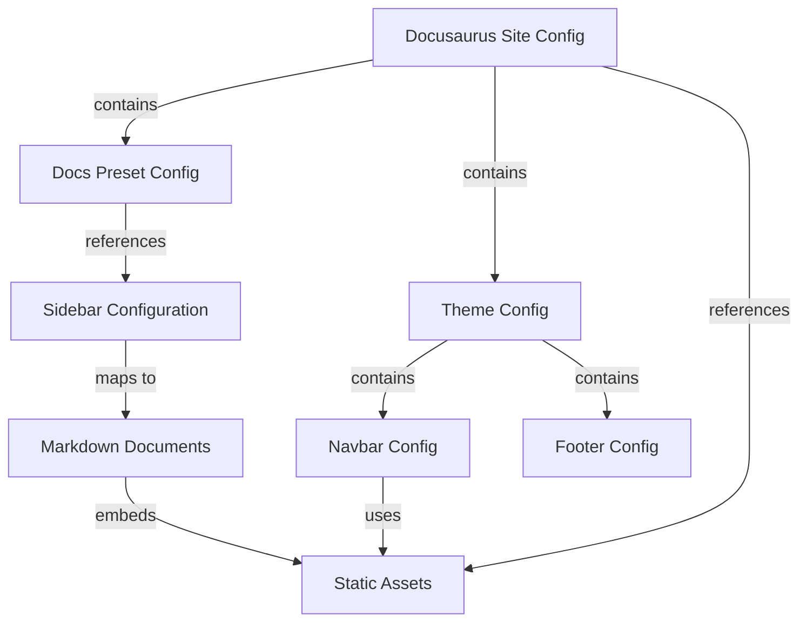

# Data Model: Docusaurus Configuration Entities

**Feature**: 003-docusaurus-deployment-fix
**Created**: 2025-12-19
**Purpose**: Define configuration entities and their relationships for Docusaurus deployment fix

---

## Entity 1: Docusaurus Site Configuration

**Definition**: Core configuration object exported from `docusaurus.config.js` defining site metadata, deployment settings, and routing behavior.

**Key Attributes**:
- `title`: Site title displayed in navbar and browser tab (e.g., "Physical AI & Humanoid Robotics")
- `tagline`: Subtitle for marketing/SEO purposes
- `url`: Production URL where site is hosted (e.g., "https://username.github.io")
- `baseUrl`: Path prefix for all site URLs (e.g., "/" for root, "/book-ai/" for GitHub Pages project repo)
- `organizationName`: GitHub username or organization for deployment
- `projectName`: GitHub repository name
- `onBrokenLinks`: Error handling strategy (`'throw'`, `'warn'`, `'ignore'`)
- `onBrokenMarkdownLinks`: Error handling for broken markdown links

**Relationships**:
- **Contains**: Preset configurations (docs, blog, theme)
- **Contains**: Theme configuration (navbar, footer, prism)
- **References**: Sidebar configuration via `sidebarPath`

**Validation Rules**:
- `url` MUST be valid HTTPS URL for production (NFR-003: no complex workarounds)
- `baseUrl` MUST have leading and trailing slashes (e.g., `/book-ai/`, not `book-ai`)
- `baseUrl` MUST match GitHub repository name for GitHub Pages project repos (FR-006)
- `organizationName` and `projectName` MUST match GitHub repository details for deployment

**State**: Singleton (one per Docusaurus project)

---

## Entity 2: Docs Preset Configuration

**Definition**: Configuration object within `presets.classic.docs` controlling documentation routing, sidebar, and editing.

**Key Attributes**:
- `routeBasePath`: URL path where docs are served (default: `'docs'`, use `'/'` for root)
- `sidebarPath`: Path to sidebar configuration file (e.g., `'./sidebars.js'`)
- `editUrl`: Base URL for "Edit this page" links to GitHub source
- `showLastUpdateTime`: Display last Git commit time (boolean)
- `showLastUpdateAuthor`: Display Git commit author (boolean)

**Relationships**:
- **Parent**: Docusaurus Site Configuration
- **References**: Sidebar Configuration (via `sidebarPath`)
- **References**: Markdown files in `docs/` directory

**Validation Rules**:
- `routeBasePath` MUST be `'/'` for root-level docs access (FR-003, FR-004)
- `routeBasePath` cannot conflict with other routes (pages, blog)
- `sidebarPath` MUST point to valid JavaScript file exporting sidebar config
- `editUrl` MUST use actual GitHub repository URL (not "your-org" placeholder)

**State**: Single instance per preset

---

## Entity 3: Sidebar Configuration

**Definition**: JavaScript object exported from `sidebars.js` defining navigation hierarchy with document IDs, labels, and category grouping.

**Key Attributes**:
- `type`: Item type (`'doc'`, `'category'`, `'link'`, `'ref'`)
- `id`: Document identifier matching file path pattern (e.g., `'module-2-digital-twin/gazebo-physics'`)
- `label`: Display text in sidebar (e.g., "Chapter 1: Gazebo Physics Simulation")
- `items`: Nested items for categories (array of sidebar items)
- `collapsed`: Boolean controlling category expand/collapse state

**Relationships**:
- **Referenced by**: Docs Preset Configuration
- **Maps to**: Markdown files in `docs/` directory (via `id` field)

**Validation Rules**:
- `id` MUST match existing markdown file path (relative to `docs/` directory)
- `id` format: `'module-name/file-slug'` (simplified, no numeric prefixes) - FR-009
- For file `docs/module-2-digital-twin/01-gazebo-physics.md`, ID is `'module-2-digital-twin/gazebo-physics'`
- All referenced IDs MUST have corresponding markdown files (prevents build errors)
- Category `items` MUST not be empty (Docusaurus build fails)

**State**: Tree structure (root sidebar → categories → docs)

---

## Entity 4: Static Asset

**Definition**: Files in `static/` directory served verbatim at build time without processing.

**Key Attributes**:
- `path`: Relative path from `static/` directory (e.g., `img/favicon.ico`)
- `type`: Asset type (`favicon`, `logo`, `image`, `file`)
- `referencedIn`: Where asset is used (`docusaurus.config.js`, markdown files, navbar)

**Relationships**:
- **Referenced by**: Docusaurus Site Configuration (`favicon`, `navbar.logo.src`, `themeConfig.image`)
- **Referenced by**: Markdown files (via `` syntax)

**Validation Rules**:
- All assets referenced in `docusaurus.config.js` MUST exist (prevents console errors) - FR-010, FR-011
- Image paths in markdown MUST use leading `/` for `static/` directory references (e.g., `/img/diagram.png`)
- Favicon MUST be `.ico` format for broad browser compatibility
- Logo SHOULD be `.svg` for scalability (or `.png` with multiple sizes)

**Required Assets**:
- `static/img/favicon.ico` - Browser tab icon (referenced line 13)
- `static/img/logo.svg` - Navbar logo (referenced line 66)
- `static/img/docusaurus-social-card.jpg` - Social preview (referenced line 61, optional)

**State**: File-based (created during setup, unchanged after build)

---

## Entity 5: Markdown Document

**Definition**: Content files in `docs/` directory with front matter and markdown body, rendered as HTML pages by Docusaurus.

**Key Attributes**:
- `sidebar_position`: Numeric ordering in sidebar (e.g., 1, 2, 3)
- `title`: Page title for browser tab and heading
- `description`: Meta description for SEO
- `slug`: Custom URL slug (optional override of filename-derived slug)
- `id`: Custom document ID (optional override, useful for sidebar references)

**Relationships**:
- **Referenced by**: Sidebar Configuration (via `id` field)
- **Contains**: Internal links to other markdown documents (relative paths)
- **Contains**: Image references to Static Assets

**Validation Rules**:
- Front matter MUST include `sidebar_position` for correct ordering
- Internal links MUST use relative paths (e.g., `./02-unity-visualization.md`) not hardcoded `/docs/` - FR-012
- Image references MUST use `/img/` prefix for static directory (e.g., ``)
- File naming pattern: `01-chapter-name.md` (numeric prefix for alphabetical sorting)
- Derived ID from filename: `chapter-name` (Docusaurus strips numeric prefix)

**State**: Static files (created during content development, modified rarely)

---

## Entity 6: Navbar Configuration

**Definition**: Navigation bar configuration in `docusaurus.config.js` defining top-level navigation items.

**Key Attributes**:
- `title`: Site title displayed in navbar
- `logo.alt`: Alt text for accessibility
- `logo.src`: Path to logo file in `static/img/`
- `items`: Array of navigation items (docs, external links, dropdown menus)

**Relationships**:
- **Part of**: Theme Configuration in Docusaurus Site Configuration
- **References**: Sidebar Configuration (via `docSidebar` type items)
- **References**: Static Assets (via `logo.src`)
- **References**: External URLs (GitHub, documentation sites)

**Validation Rules**:
- `logo.src` MUST point to existing file in `static/img/` - FR-011
- `items` with `type: 'docSidebar'` MUST reference valid `sidebarId` from sidebars.js - FR-007
- External `href` links MUST use actual GitHub repository URL (not "your-org" placeholder) - FR-007

**Current Items**:
1. Line 70-74: "Textbook" docSidebar link (correct)
2. Line 76-79: GitHub link (needs placeholder replacement)

**State**: Configured once, rarely modified

---

## Configuration Dependencies

**Key Relationships**:
1. **Site Config** → **Docs Preset**: `routeBasePath` determines URL structure
2. **Docs Preset** → **Sidebar Config**: `sidebarPath` links to navigation definition
3. **Sidebar Config** → **Markdown Docs**: `id` fields map to file paths
4. **Site/Navbar** → **Static Assets**: `favicon`, `logo.src` reference asset files
5. **Markdown Docs** → **Static Assets**: Image references embed assets

**Breaking Changes Impact**:
- Changing `routeBasePath` breaks existing URLs (requires full testing)
- Changing `baseUrl` breaks GitHub Pages deployment (asset loading fails)
- Changing sidebar IDs breaks navigation (404 errors)
- Missing static assets cause console errors and broken images

---

**Data Model Version**: 1.0.0
**Last Updated**: 2025-12-19
**Entities**: 6 (Site Config, Docs Config, Sidebar Config, Static Asset, Markdown Document, Navbar Config)
